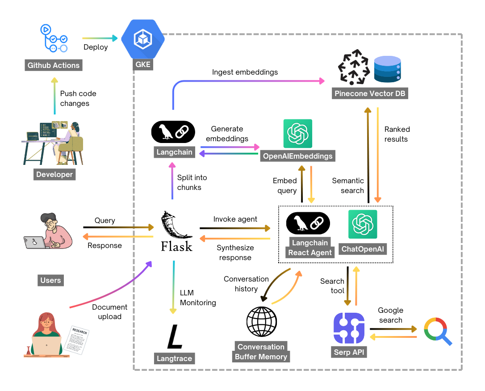

# Research Paper RAG Chatbot
A Retrieval-Augmented Generation (RAG) chatbot built with LangChain, OpenAI, Pinecone, and Flask. This chatbot can process and answer questions about research papers stored in PDF format.

## Features
- 📄 PDF document ingestion and processing
- 📤 Upload new research papers through the web interface
- 🔍 Vector storage using Pinecone for intelligent document retrieval
- 💬 Conversational memory to maintain context across sessions
- 🌐 Web-based chat interface with modern, responsive design
- ⚡ Real-time response streaming
- 📊 LLM observability and monitoring with Langtrace
- 🔗 Web search integration via SerpAPI for comprehensive answers
- 🤖 ReAct agent pattern for intelligent decision-making

## Prerequisites
- Python 3.8 or higher
- Groq API key (Free - [Get one here](https://console.groq.com/))
- Pinecone API key ([Sign up here](https://app.pinecone.io/))
- Langtrace API key (Optional - [Get one here](https://langtrace.ai/))
- SerpAPI key (Optional - [Get one here](https://serpapi.com/))

## 🚀 Quick Start - Local Development

### Manual Setup (Updated for Groq)

1. **Create and activate virtual environment:**
   ```bash
   python -m venv rag_chatbot_env
   
   # Windows
   rag_chatbot_env\Scripts\activate
   
   # Linux/Mac
   source rag_chatbot_env/bin/activate
   ```

2. **Install dependencies:**
   ```bash
   pip install -r requirements.txt
   ```

3. **Create environment file:**
   Create a `.env` file with the following content:
   ```bash
   # Research Paper RAG Chatbot - Local Development Environment
   FLASK_SECRET_KEY=your_flask_secret_key_here_please_change_this
   ENVIRONMENT=development
   
   # Groq API Key (Required) - Get free at: https://console.groq.com/
   GROQ_API_KEY=your_groq_api_key_here
   
   # Pinecone API Key (Required) - Get at: https://app.pinecone.io/
   PINECONE_API_KEY=your_pinecone_api_key_here
   
   # Pinecone Index Name
   INDEX_NAME=research-chatbot-index
   
   # Langtrace API Key (Optional) - Get at: https://langtrace.ai/
   LANGTRACE_API_KEY=your_langtrace_api_key_here
   
   # SerpAPI Key (Optional) - Get at: https://serpapi.com/
   SERPAPI_API_KEY=your_serpapi_api_key_here
   ```

4. **Run the application:**
   ```bash
   python main.py
   ```

### 🌐 Access the Application
Open your web browser and navigate to: **http://localhost:8000**

## 🔧 Configuration

### Required API Keys
- **Groq API Key**: Used for Llama3-8B language model (Free!)
- **Pinecone API Key**: Used for vector database storage and retrieval

### Optional API Keys
- **Langtrace API Key**: For LLM monitoring and observability (recommended for production)
- **SerpAPI Key**: For web search functionality (enhances answer quality)

### Environment Variables
All configuration is handled through the `.env` file:
```bash
FLASK_SECRET_KEY=your_flask_secret_key_here
ENVIRONMENT=development
GROQ_API_KEY=your_groq_api_key_here
PINECONE_API_KEY=your_pinecone_api_key_here
INDEX_NAME=research-chatbot-index
LANGTRACE_API_KEY=your_langtrace_api_key_here  # Optional
SERPAPI_API_KEY=your_serpapi_api_key_here      # Optional
```

## 📱 Usage

1. **Upload Research Papers**: Use the upload section to add PDF research papers
2. **Ask Questions**: Type questions about the uploaded papers in the chat interface
3. **Get Intelligent Answers**: The system will search your documents and provide contextual answers
4. **Web Search Integration**: If local documents don't have enough information, the system can search the web

## 🛠️ Troubleshooting

### Common Issues

**1. Import Errors**
```bash
# Make sure virtual environment is activated
# Windows
rag_chatbot_env\Scripts\activate
# Linux/Mac
source rag_chatbot_env/bin/activate
```

**2. API Key Errors**
- Ensure all required API keys are set in `.env` file
- Check that Groq and Pinecone keys are valid
- Groq API keys are free at https://console.groq.com/

**3. Port Already in Use**
- The app runs on port 8000 by default
- Change the port in `main.py` if needed: `app.run(debug=True, host='0.0.0.0', port=8001)`

**4. PDF Processing Issues**
- Only PDF files are supported
- Files should be under 5MB for best performance
- Ensure PDFs contain readable text (not just images)

## 📊 Features Overview

- **Smart Document Processing**: Automatically chunks documents for optimal retrieval
- **Conversational Memory**: Maintains context across multiple questions
- **Hybrid Search**: Combines document retrieval with web search when needed
- **Real-time Responses**: Streaming responses for better user experience
- **Monitoring**: Built-in observability with Langtrace integration

## 🖼️ Screenshots

### System Architecture


### Chatbot Interface


### Monitoring Dashboard


## 🤝 Contributing

1. Fork the repository
2. Create a feature branch
3. Make your changes
4. Test thoroughly
5. Submit a pull request

## 📄 License

This project is open source. Please check the license file for details.